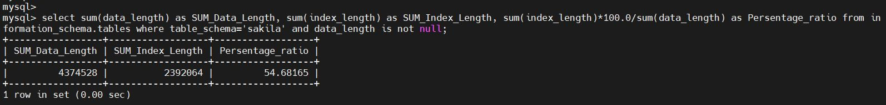
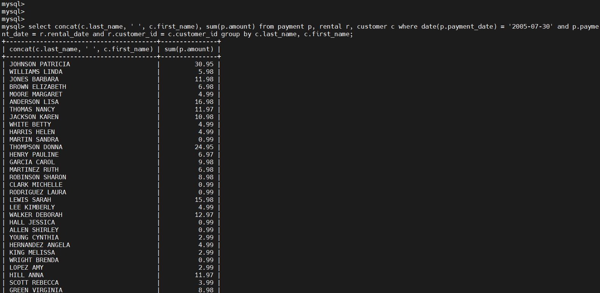

Домашнее задание к занятию "Индексы" - <Бычков Денис Вячеславович>

Задание 1
Напишите запрос к учебной базе данных, который вернёт процентное отношение общего размера всех индексов к общему размеру всех таблиц.

select sum(data_length) as SUM_Data_Length, sum(index_length) as SUM_Index_Length, sum(index_length)*100.0/sum(data_length) as Persentage_ratio
from information_schema.tables
where table_schema='sakila' and data_length is not null;

Задание 2
Выполните explain analyze следующего запроса:

select distinct concat(c.last_name, ' ', c.first_name), sum(p.amount) over (partition by c.customer_id, f.title)
from payment p, rental r, customer c, inventory i, film f
where date(p.payment_date) = '2005-07-30' and p.payment_date = r.rental_date and r.customer_id = c.customer_id and i.inventory_id = r.inventory_id
перечислите узкие места;
оптимизируйте запрос: внесите корректировки по использованию операторов, при необходимости добавьте индексы.

Запрос слишком сложный и в нём используются избыточные таблицы. Из запроса можно убрать фрагмент over (partition by c.customer_id, f.title) и оператор distinct. Так же убираем избыточные таблицы film и inventory:

select concat(c.last_name, ' ', c.first_name), sum(p.amount)
from payment p, rental r, customer c
where date(p.payment_date) = '2005-07-30' and p.payment_date = r.rental_date and r.customer_id = c.customer_id
group by c.last_name, c.first_name;

